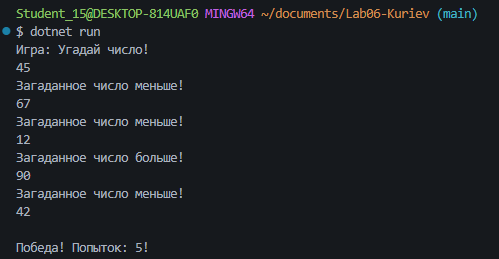
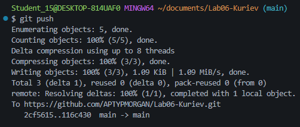

# Практическая работа №6

**Куриев Артур Майрбекович**
**Группа: ИСП-241**
**Дата: 08.10.2026**

## Что изучено

* Работа с циклами `for`, `while` и `do while`

* Использование `break` и `continue`

* Отличие `while` от `do while`. А именно `do while` выполнить **хотя-бы 1 раз,** даже если условие после него будет *ложным*, а `while` не выполнится **ни разу**, если изначальное условие будет *`false`*.

